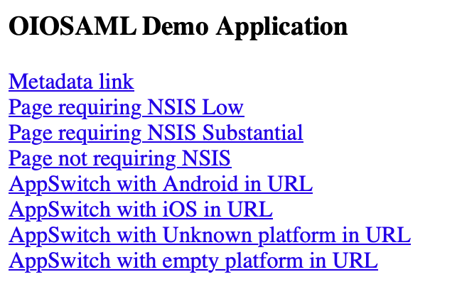

# OIOSAML.Java

OIOSAML.Java is a SAML 2.0 framework for Java, intended for use with NemLog-in3, but it can also be used as a generic SAML framework for Java.

The framework supports the OIO SAML 3.0 profile and can generate `AuthnRequest`s and perform validation on SAML Assertions according to this profile. It works with **Java 11+**.

This document covers how to use and configure the OIOSAML.Java 3.x framework.

## Table of Contents

- [Versions and releases](#versions-and-releases)
- [Overview](#overview)
- [Mandatory configuration](#mandatory-configuration)
  - [DispatcherServlet](#dispatcherservlet)
  - [AuthenticatedFilter](#authenticatedfilter)
- [How to configure OIOSAML](#how-to-configure-oiosaml)
  - [Configure through web.xml](#configure-through-webxml)
- [Configuration parameters](#configuration-parameters)
  - [DispatcherServlet parameters](#dispatcherservlet-parameters)
  - [AuthenticatedFilter parameters](#authenticatedfilter-parameters)
  - [DispatcherServlet configuration from file](#dispatcherservlet-configuration-from-file)
  - [Multiple AuthenticatedFilters and step-up](#multiple-authenticatedfilters-and-step-up)
  - [AppSwitch extension](#appswitch-extension)
- [Additional configuration](#additional-configuration)
- [Maven dependency](#maven-dependency)
- [Demo application](#demo-application)
- [Logging](#logging)
- [Audit logging](#audit-logging)
- [OIOSAML session handling](#oiosaml-session-handling)
- [Test Identity Provider](#test-identity-provider)
- [Building and testing](#building-and-testing)

## Versions and releases

Please note that the tagged version in Git does **not** follow the OIO SAML profile version. The correlation is described below.

See content and changes of releases in the [release notes](RELEASE_NOTES.md).

### OIO SAML 2 — Artifact ID `oiosaml2.java`

| OIO SAML profile | Latest Maven release |
|------------------|----------------------|
| 2.0.9            | 2.1.2                |
| 2.1.0            | 2.1.2                |

Available on [Maven Central](https://mvnrepository.com/artifact/dk.digst/oiosaml2.java).

### OIO SAML 3 — Artifact ID `oiosaml3.java`

| OIO SAML profile | Latest Maven release |
|------------------|----------------------|
| 3.0.2            | 3.2.2                |

Available on [Maven Central](https://mvnrepository.com/artifact/dk.digst/oiosaml3.java).

> **Version 3.0.0 note:** Version 3.0.0 was released before NemLog-in3 was ready for use, so implementation and testing were performed against NemLog-in2. It is therefore not certain that version 3.0.0 will function optimally against NemLog-in3. It is recommended to upgrade to the latest 3.x version.

## Overview

The framework consists of two primary classes, which must be configured to use the framework:

- `dk.gov.oio.saml.servlet.DispatcherServlet`
- `dk.gov.oio.saml.filter.AuthenticatedFilter`

The first is a `Servlet` implementation that must be exposed on `/saml/*`, so it can manage all SAML related requests.

The second is a `Filter` implementation that should be placed in front of any web-resources that require the user to be authenticated. It ensures that the user goes through the SAML login process before they can access the web-resource that the filter is placed in front of.

## Mandatory configuration

Both the `DispatcherServlet` and the `AuthenticatedFilter` require some minimum configuration before they can be used. The full configuration of both classes is described in the following chapters, but for a quick setup the following is the only required configuration.

### DispatcherServlet

The `DispatcherServlet` must be configured with the following information before it can be used:

- KeyStore configuration, used for signing `AuthnRequest`s and decrypting SAML responses
- SAML EntityID for the application
- BaseURL to be used for SAML metadata generation
- IdP metadata reference (URL or file)

With these settings in place, the `DispatcherServlet` will function. More configuration is possible, as documented in the following chapters.

### AuthenticatedFilter

The `AuthenticatedFilter` has no mandatory configuration settings. If not configured, it will use the default settings as documented in the following chapters.

## How to configure OIOSAML

All configuration is done through the servlet and filter classes, and the configuration is supplied through the `FilterConfig` and `ServletConfig` classes supplied when creating a servlet or filter in Java.

How this is done depends on the specific application framework used together with OIOSAML.Java, but the most common way is to configure servlets and filters through a `web.xml` deployment file, as shown below.

### Configure through web.xml

If the Java application contains a `web.xml` deployment file, this can be used to configure any servlets and filters in the application, including OIOSAML.Java.

The `DispatcherServlet` can be configured in the following way (see [Configuration parameters](#configuration-parameters) below for which keys and values can be used in the `init-param` sections):

```xml
<servlet>
    <servlet-name>DispatcherServlet</servlet-name>
    <servlet-class>dk.gov.oio.saml.servlet.DispatcherServlet</servlet-class>
    <init-param>
        <param-name>CONFIG_KEY_1</param-name>
        <param-value>CONFIG_VALUE_1</param-value>
    </init-param>
    <init-param>
        <param-name>CONFIG_KEY_2</param-name>
        <param-value>CONFIG_VALUE_2</param-value>
    </init-param>
    <!-- … etc … -->
    <load-on-startup>1</load-on-startup>
</servlet>
```

And then deployed with the following section:

```xml
<servlet-mapping>
    <servlet-name>DispatcherServlet</servlet-name>
    <url-pattern>/saml/*</url-pattern>
</servlet-mapping>
```

Similarly, the `AuthenticatedFilter` can be configured and deployed like this:

```xml
<filter>
    <filter-name>AuthenticatedFilter</filter-name>
    <filter-class>dk.gov.oio.saml.filter.AuthenticatedFilter</filter-class>
    <init-param>
        <param-name>CONFIG_KEY_1</param-name>
        <param-value>CONFIG_VALUE_1</param-value>
    </init-param>
</filter>

<filter-mapping>
    <filter-name>AuthenticatedFilter</filter-name>
    <url-pattern>/protected/*</url-pattern>
</filter-mapping>
```

Configuration of the `SessionDestroyListener` also needs to be added, so that sessions destroyed by the server are also removed from the OIOSAML session handler. The configuration is as follows:

```xml
<listener>
    <listener-class>dk.gov.oio.saml.session.SessionDestroyListener</listener-class>
</listener>
```

## Configuration parameters

This chapter describes all the configuration parameters and their default values.

### DispatcherServlet parameters

| Setting | Mandatory | Default value | Description |
|---------|-----------|---------------|-------------|
| `oiosaml.servlet.entityid` | Yes | | The EntityID which identifies the application as a Service Provider, e.g. `http://saml.serviceprovider.com`. |
| `oiosaml.servlet.baseurl` | Yes | | The URL on which the application is accessible in a web-browser. The value is used to generate SAML metadata, which must contain login/logout URL endpoints, e.g. `https://serviceprovider.com`. The value above results in generated metadata URLs like `https://serviceprovider.com/saml/assertionConsumer`. |
| `oiosaml.servlet.keystore.location` | Yes | | The name of the PKCS#12 keystore file, located on the classpath of the application. |
| `oiosaml.servlet.keystore.password` | Yes | | The password to the PKCS#12 keystore given above. |
| `oiosaml.servlet.keystore.alias` | Yes | | The alias of the key entry in the PKCS#12 keystore given above. |
| `oiosaml.servlet.idp.entityid` | Yes | | The EntityID of the SAML Identity Provider that is used for login. |
| `oiosaml.servlet.idp.metadata.file` | Partially | | A FILE reference to the SAML Identity Provider metadata. The file must be located on the classpath of the application. Note that either a FILE or URL reference is required. |
| `oiosaml.servlet.idp.metadata.url` | Partially | | A URL reference to the SAML Identity Provider metadata. Note that either a FILE or URL reference is required. |
| `oiosaml.servlet.configurationfile` | No | | A FILE reference to a configuration file. If supplied, the `DispatcherServlet` will read its configuration from that file instead of the `ServletConfig` section. See [DispatcherServlet configuration from file](#dispatcherservlet-configuration-from-file). |
| `oiosaml.servlet.profile.validation.enabled` | No | `true` | By default, the framework performs OIO SAML 3.0 profile validation. If this is not needed, turn off this setting by setting the value to `false`. |
| `oiosaml.servlet.profile.validation.assurancelevel.allowed` | No | `false` | The NemLog-in IdP cannot for all authentication provide a NSIS LoA. Therefore the service provider can decide to accept the AssuranceLevel which the NemLog-in IdP provides instead. If this is not acceptable, turn off this setting by omitting it or setting the value to `false`. |
| `oiosaml.servlet.profile.validation.assurancelevel.minimum` | No | `3` | If the AssuranceLevel is acceptable, a minimum value can be specified using this setting. Any integer is accepted, however the NemLog-in IdP will never provide an integer larger than 3. |
| `oiosaml.servlet.metadata.nameid.format` | No | `urn:oasis:names:tc:SAML:2.0:nameid-format:persistent` | By default, the framework generates SAML metadata that contains a requested NameID format with this value. To change the value, enter another SAML NameID format. |
| `oiosaml.servlet.metadata.contact.email` | No | | By default, the framework does not generate a Contact section in the SAML metadata. Supply an email address here if a Contact section is needed. |
| `oiosaml.servlet.idp.metadata.refresh.min` | No | `1` | By default, the framework attempts to refresh the Identity Provider metadata sometime between 1 and 12 hours. Change this value to change the lower bound of the interval (in hours). |
| `oiosaml.servlet.idp.metadata.refresh.max` | No | `12` | By default, the framework attempts to refresh the Identity Provider metadata sometime between 1 and 12 hours. Change this value to change the upper bound of the interval (in hours). |
| `oiosaml.servlet.secondary.keystore.location` | No | | Configured like the primary keystore above, but allows adding a second certificate to the SAML metadata, allowing for changing the certificate with low to no downtime. Requires the SAML Identity Provider to support multiple certificates. |
| `oiosaml.servlet.secondary.keystore.password` | No | | Configured like the primary keystore above, but allows adding a second certificate to the SAML metadata, allowing for changing the certificate with low to no downtime. Requires the SAML Identity Provider to support multiple certificates. |
| `oiosaml.servlet.secondary.keystore.alias` | No | | Configured like the primary keystore above, but allows adding a second certificate to the SAML metadata, allowing for changing the certificate with low to no downtime. Requires the SAML Identity Provider to support multiple certificates. |
| `oiosaml.servlet.signature.algorithm` | No | `http://www.w3.org/2001/04/xmldsig-more#rsa-sha256` | By default, the RSA SHA256 algorithm is used for signing. Change this value if another algorithm is needed. |
| `oiosaml.servlet.secondary.page.error` | No | | The framework has a built-in error page, which is shown in case of SAML related errors. Set this value to redirect the user to another webpage in case of errors. See [Additional configuration](#additional-configuration) for details on getting error information. |
| `oiosaml.servlet.secondary.page.logout` | No | | The framework redirects the user to the context root of the web application after a successful logout. Set this value to redirect the user to another webpage instead of the context root. |
| `oiosaml.servlet.secondary.page.login` | No | | When the login process completes, the framework attempts to redirect the user to the web-resource they tried to access before login started. If this fails, the framework redirects to the page specified by the value. If no value is specified, the context root of the application is used. |
| `oiosaml.servlet.trust.selfsigned.certs` | No | `false` | By default, the framework performs certificate validation when accessing HTTPS-protected resources like SAML metadata. Set this value to `true` to disable certificate validation. |
| `oiosaml.servlet.revocation.crl.check.enabled` | No | `true` | By default, the framework performs revocation checking using OCSP and CRL. Set this value to `false` to disable CRL revocation checking. |
| `oiosaml.servlet.revocation.ocsp.check.enabled` | No | `true` | By default, the framework performs revocation checking using OCSP and CRL. Set this value to `false` to disable OCSP revocation checking. |
| `oiosaml.servlet.routing.path.prefix` | No | `saml` | Routing configuration: servlet path prefix for the OIO dispatch servlet. Change this to change where the OIOSAML 3 endpoint is mounted in the application context (`oiosaml.servlet.baseurl`). Example: with the default, the logout action is hit at `/{prefix}/{suffix.logout}` = `/saml/logout`. |
| `oiosaml.servlet.routing.path.suffix.error` | No | `error` | Routing configuration: servlet error path. |
| `oiosaml.servlet.routing.path.suffix.metadata` | No | `metadata` | Routing configuration: servlet metadata path. |
| `oiosaml.servlet.routing.path.suffix.logout` | No | `logout` | Routing configuration: servlet logout path. |
| `oiosaml.servlet.routing.path.suffix.logoutResponse` | No | `logoutResponse` | Routing configuration: servlet logoutResponse path. |
| `oiosaml.servlet.routing.path.suffix.assertion` | No | `assertionConsumer` | Routing configuration: servlet assertionConsumer path. |
| `oiosaml.servlet.audit.logger.classname` | No | `dk.gov.oio.saml.audit.Slf4JAuditLogger` | Class reference for the AuditLogger used in the project. See [Audit logging](#audit-logging). |
| `oiosaml.servlet.audit.logger.attribute.ip` | No | `request:remoteAddr` | Used in audit logging to look up and log the user's IP address. See [Audit logging](#audit-logging). |
| `oiosaml.servlet.audit.logger.attribute.port` | No | `request:remotePort` | Used in audit logging to look up and log the user's port. See [Audit logging](#audit-logging). |
| `oiosaml.servlet.audit.logger.attribute.userid` | No | `request:remoteUser` | Used in audit logging to look up and log the user's UserId in the SP application. See [Audit logging](#audit-logging). |
| `oiosaml.servlet.audit.logger.attribute.sessionId` | No | `request:sessionId` | Used in audit logging to look up and log the user's SessionId in the SP application. See [Audit logging](#audit-logging). |
| `oiosaml.servlet.session.handler.factory` | No | `dk.gov.oio.saml.session.inmemory.InMemorySessionHandlerFactory` | Class reference for the `SessionHandlerFactory` used when handling sessions. The following factories already exist in the project: `dk.gov.oio.saml.session.database.JdniSessionHandlerFactory`, `dk.gov.oio.saml.session.database.JdbcSessionHandlerFactory`, `dk.gov.oio.saml.session.inmemory.InMemorySessionHandlerFactory`. |
| `oiosaml.servlet.session.handler.jdni.name` | No | | Configuration parameter for the JNDI session handler factory (`JdniSessionHandlerFactory`). JNDI name for the database, e.g. `jdbc:h2:mem:mydb`. |
| `oiosaml.servlet.session.handler.jdbc.url` | No | | Configuration parameter for the JDBC session handler factory (`JdbcSessionHandlerFactory`). JDBC connection URL for the database, e.g. `jdbc:mysql://@localhost:3306/oiosaml`. |
| `oiosaml.servlet.session.handler.jdbc.username` | No | | Configuration parameter for the JDBC session handler factory (`JdbcSessionHandlerFactory`). JDBC connection username, e.g. `username`. |
| `oiosaml.servlet.session.handler.jdbc.password` | No | | Configuration parameter for the JDBC session handler factory (`JdbcSessionHandlerFactory`). JDBC connection password, e.g. `password`. |
| `oiosaml.servlet.session.handler.jdbc.driver.classname` | No | | Configuration parameter for the JDBC session handler factory (`JdbcSessionHandlerFactory`). JDBC driver class name for the connection, e.g. for MySQL: `com.mysql.cj.jdbc.Driver`. Remember to add the driver dependency in the POM. |
| `oiosaml.servlet.session.handler.inmemory.max.tracked.assertionids` | No | `10000` | Configuration parameter for the in-memory session handler factory (`InMemorySessionHandlerFactory`). The maximum number of tracked Assertion IDs used to ensure that requests are not replayed. Old elements are removed first. |

### AuthenticatedFilter parameters

| Setting | Mandatory | Default value | Description |
|---------|-----------|---------------|-------------|
| `oiosaml.filter.ispassive.enabled` | No | `false` | If the filter should send `AuthnRequest`s with `isPassive=true`, set this value to `true`. |
| `oiosaml.filter.forceauthn.enabled` | No | `false` | If the filter should send `AuthnRequest`s with `forceAuthn=true`, set this value to `true`. |
| `oiosaml.filter.nsis.required` | No | `NONE` | If a minimum NSIS level is required, set the value to one of `LOW`, `SUBSTANTIAL` or `HIGH`. The filter will generate an `AuthnRequest` that contains the required value and validate that the issued Assertion contains at least this value. When set to `NONE`, an issued Assertion with any AssuranceLevel is implicitly accepted. |
| `oiosaml.filter.attribute.profile` | No | | If a specific profile is required in the assertion from the IdP (Person or Professional), set this value to one of `https://data.gov.dk/eid/Person` or `https://data.gov.dk/eid/Professional`. The filter will generate an `AuthnRequest` with the requested profile and perform validation on the issued Assertion. |

### DispatcherServlet configuration from file

If the `oiosaml.servlet.configurationfile` setting is supplied to the `DispatcherServlet`, it will read its configuration from the supplied file instead. This file should be an ordinary property file, supplying properties as key/value pairs like the example below:

```properties
oiosaml.servlet.idp.entityid=https://saml.test-nemlog-in.dk/
oiosaml.servlet.idp.metadata.url=https://test-nemlog-in.dk/Testportal/Test-nemlog-in-2.xml
```

### Multiple AuthenticatedFilters and step-up

It is possible to configure multiple `AuthenticatedFilter`s, each with its own configuration. One common use case for this is requiring different NSIS levels for different resources in the application.

If both a `LOW` and a `SUBSTANTIAL` filter is configured, and the user tries to access a resource protected by the `LOW` filter, then the `AuthnRequest` will inform the Identity Provider that the user only needs to perform a NSIS LOW login. If the user then later tries to access a resource protected by the `SUBSTANTIAL` filter, it will perform a step-up and ask the Identity Provider to increase the NSIS level by performing additional authentication with the user.

### AppSwitch extension

When using the AppSwitch extension for an iOS or Android app, the following configuration parameters should be defined.

| Setting | Mandatory | Default value | Description |
|---------|-----------|---------------|-------------|
| `oiosaml.appswitch.returnurl.android` | No | empty | Should contain the dynamic link for the Android application. |
| `oiosaml.appswitch.returnurl.ios` | No | empty | Should contain the universal link for the iOS application. |

Triggering the AppSwitch extension is done by adding the `appSwitchPlatform=<PLATFORM>` parameter to the URL when starting an authentication flow, where `<PLATFORM>` is either `Android` or `iOS`. The `appSwitchPlatform` parameter is case-insensitive.

## Additional configuration

As SAML requires cross-domain configuration, and modern browsers by default prevent sending cookies on cross-domain requests, SAML login can under certain circumstances fail because no session can be found when parsing the response from the SAML Identity Provider.

One solution is to ensure that the `SameSite` attribute is set to `None` when issuing sessions. If this can be done in a controlled fashion from the application itself, that is fine.

If not, the OIOSAML framework supplies a filter that can be used for setting the `SameSite` attribute to `None` on all issued cookies.

> **Note!** If the `SameSite` attribute is already set to some value, the filter will **not** modify the attribute. It will only set the `SameSite` attribute on cookies that do not already have that attribute.

The `SameSite` filter must be configured to run before any other filters that may create sessions. When using `web.xml` as a deployment mechanism, this is done by placing the `SameSite` filter before the other filters (e.g. above the `AuthenticatedFilter` in `web.xml`).

There is no configuration of the filter, just deployment as shown in the example below:

```xml
<filter>
    <filter-name>SameSiteFilter</filter-name>
    <filter-class>dk.gov.oio.saml.filter.SameSiteFilter</filter-class>
</filter>

<filter-mapping>
    <filter-name>SameSiteFilter</filter-name>
    <url-pattern>/*</url-pattern>
</filter-mapping>
```

## Maven dependency

OIOSAML is released as a publicly available Maven dependency and can be included as shown below. Make sure to change the version number to the latest version.

```xml
<dependency>
    <groupId>dk.digst</groupId>
    <artifactId>oiosaml3.java</artifactId>
    <version>3.2.2</version>
</dependency>
```

## Demo application

A demo application is supplied with the OIOSAML.Java source code. The demo application shows how to use the OIOSAML framework and contains the following structure:

```text
├── pom.xml
└── src
    └── main
        ├── resources
        │   ├── keystore.p12
        │   ├── log4j2.properties
        │   ├── oiosaml.properties
        │   ├── test-devtest4-idp-metadata.xml
        │   └── Test-nemlog-in-2.xml
        └── webapp
            ├── appswitch
            │   └── private.jsp
            ├── error.jsp
            ├── index.jsp
            ├── low
            │   └── private.jsp
            ├── nonsis
            │   └── private.jsp
            ├── substantial
            │   └── private.jsp
            └── WEB-INF
                └── web.xml
```

The `resources` folder contains the keystore and IdP metadata used by the application. The rest of the `src` folder contains the web application, with the following files being relevant.

### oiosaml.properties

The demo application uses an external file for configuring the `DispatcherServlet`, and the configuration can be found here.

### web.xml

The demo application shows how to configure the `DispatcherServlet` and `AuthenticatedFilter` (with step-up) in the `web.xml` file.

### private.jsp

Finally, there are three folders, each containing identical JSP files. These files are protected by the `AuthenticatedFilter` by various NSIS level requirements and will show the content of the issued SAML assertion.

### Running the demo application

Compiling and running the demo application is performed with Maven like this:

```bash
$ mvn clean install tomcat7:run-war
```

> Note that Tomcat 7 performs some validation on class files during startup, which has some issues with JAXB. This results in warnings that can safely be ignored. Tomcat 8 does not have these issues.

Once the application is running, it can be accessed at <https://localhost:8443/oiosaml3-demo.java/>.

It should show a page that looks like this:



The various links will either download the SAML metadata generated by the demo application or attempt to access one of the protected resources.

## Logging

OIOSAML uses SLF4J as its logging framework, as does OpenSAML, but OpenSAML has dependencies that require JCL and Log4j.

To implement a logging framework in OIOSAML we need to bridge JCL and Log4j to SLF4J and choose an output logging framework.

Bridging JCL and Log4j to SLF4J is done by including these dependencies in the demo project:

```xml
<dependency>
    <groupId>org.slf4j</groupId>
    <artifactId>slf4j-api</artifactId>
    <version>1.7.32</version>
</dependency>

<dependency>
    <groupId>org.slf4j</groupId>
    <artifactId>jcl-over-slf4j</artifactId>
    <version>1.7.32</version>
</dependency>

<dependency>
    <groupId>org.slf4j</groupId>
    <artifactId>log4j-over-slf4j</artifactId>
    <version>1.7.32</version>
</dependency>
```

Customizing your logging solution is then done by selecting an implementation. If you need to write log output to your own custom implementation of a logging framework, the simplest solution is to fork [slf4j-simple](https://github.com/qos-ch/slf4j/tree/master/slf4j-simple) and write your own implementation of `SimpleLogger` (look at `innerHandleNormalizedLoggingCall()`).

To write logging using Log4j 2 like in the demo project, just add this dependency:

```xml
<dependency>
    <groupId>org.apache.logging.log4j</groupId>
    <artifactId>log4j-slf4j-impl</artifactId>
    <version>2.14.1</version>
</dependency>
```

Most logging frameworks have an SLF4J implementation or bridge. Implementing logging in your project comes down to adding dependencies to forward logging from OIOSAML and its dependencies to your preferred logging framework.

## Audit logging

The audit logging must be persisted for 6 months and contain information relevant to use of the functionality exposed in the OIOSAML service.

The audit log is channeled through the `AuditLogger` interface, which can be overridden in configuration by providing your own implementation via the configuration property `oiosaml.servlet.audit.logger.classname`.

If you use the default SLF4J implementation, it is important to configure logging so that the audit log output is persisted for 6 months. The `Slf4JAuditLogger` implementation adds an `AUDIT` tag to log messages, that can be used to store audit logging separate from regular application logging.

### Implementing a custom AuditLogger

To replace the default SLF4J audit logger, you can implement your own `AuditLogger` by providing an implementation of `dk.gov.oio.saml.audit.AuditLogger` in the configuration like this:

```properties
oiosaml.servlet.audit.logger.classname=dk.gov.oio.saml.audit.Slf4JAuditLogger
```

Take a look at `dk.gov.oio.saml.audit.Slf4JAuditLogger` for inspiration. To support a JPA-based implementation, just remember that we need a default constructor and that injection will not work out of the box.

### Configuring audit logging

You can customize content in the audit logging for a few attributes: IP, Port, UserId and SessionId. This is done by providing values for these configuration parameters:

```properties
oiosaml.servlet.audit.logger.attribute.ip=request:remoteAddr
oiosaml.servlet.audit.logger.attribute.port=request:remotePort
oiosaml.servlet.audit.logger.attribute.userid=request:remoteUser
oiosaml.servlet.audit.logger.attribute.sessionId=request:sessionId
```

The configuration values conform to the following EBNF syntax:

```ebnf
<value>     ::= <protocol>:<attribute>
<protocol>  ::= <query> | <header> | <cookie> | <session> | <request>
<attribute> ::= Name of an attribute accessible from the selected protocol.
<query>     ::= Access to GET and form POST query parameters/attributes.
<header>    ::= Access to request header names, as parameters/attributes.
<cookie>    ::= Access to request cookie names, as parameters/attributes.
<session>   ::= Access to session values, i.e. to access SessionId for logging.
<request>   ::= remoteHost | remoteAddr | remotePort | remoteUser  (from the servlet request)
```

To use the `JSESSIONID` cookie as SessionId in the audit log, add the following to your OIOSAML configuration:

```properties
oiosaml.servlet.audit.logger.attribute.sessionId=cookie:JSESSIONID
```

## OIOSAML session handling

Session handling in OIOSAML is configured in `oiosaml.properties` by providing a factory for creating the session handler and its configuration. The class reference to the session handler factory is provided by setting the configuration property `oiosaml.servlet.session.handler.factory`.

The following session handler factories are provided in the OIOSAML project:

- `InMemorySessionHandlerFactory`
- `JdbcSessionHandlerFactory`
- `JdniSessionHandlerFactory`

You can provide your own implementation based on the `SessionHandlerFactory` interface:

```java
public interface SessionHandlerFactory {
    void configure(Configuration config) throws InitializationException;
    SessionHandler getHandler() throws InternalException;
    void close();
}
```

Take a look at the provided implementations for inspiration. You will need your own implementation if performance is an issue, i.e. to ensure that connections are provided by a connection pool, or if you would like to optimize the solution with caching.

### In-memory session handling

This is the default session handler.

The in-memory session handler is a simple implementation that stores all values on the HTTP session. Its only configuration property is `oiosaml.servlet.session.handler.inmemory.max.tracked.assertionids`, which limits the size of the list containing requested Assertion IDs used to prevent replay.

### Database session handling

OIOSAML contains two database session handler factories for initializing session handling on a database using JNDI or JDBC.

Initializing the database to use the OIOSAML database session handler is done by executing the DDL script included in the `/misc` folder (`database_session_handler.sql`). The script will create a database and tables for the database session handler.

The sample configuration below can be used on a default installation of MySQL if you start by executing the `database_session_handler.sql` script on the database (set passwords and create application users as needed).

#### Sample JNDI configuration

```properties
oiosaml.servlet.session.handler.factory=dk.gov.oio.saml.session.database.JdniSessionHandlerFactory
oiosaml.servlet.session.handler.jdni.name=jdbc:h2:mem:oiosaml
```

#### Sample JDBC configuration

```properties
oiosaml.servlet.session.handler.factory=dk.gov.oio.saml.session.database.JdbcSessionHandlerFactory
oiosaml.servlet.session.handler.jdbc.url=jdbc:mysql://@localhost:3306/oiosaml
oiosaml.servlet.session.handler.jdbc.username=root
oiosaml.servlet.session.handler.jdbc.password=
oiosaml.servlet.session.handler.jdbc.driver.classname=com.mysql.cj.jdbc.Driver
```

### Configuration of session cleanup

OIOSAML has two cleanup jobs: one to ensure that inactive sessions are removed, and one to ensure that HTTP sessions that have been destroyed are also removed from the OIOSAML session handler.

Both the session handler and the session cleaner service are initialized in `OIOSAML3Service`, but the `SessionDestroyListener` is set up in the demo project as part of the `web.xml`. The configuration is as follows:

```xml
<listener>
    <listener-class>dk.gov.oio.saml.session.SessionDestroyListener</listener-class>
</listener>
```

If you are unable to use this `SessionDestroyListener` as is, you will need to provide something similar to remove sessions that have been invalidated outside OIOSAML.

## Test Identity Provider

A test Identity Provider is supplied with the OIOSAML.Java source code. It is primarily used for manual testing when developing the OIOSAML.Java framework and should not be considered a production-ready Identity Provider.

The demo application can be used with the test Identity Provider by modifying the `oiosaml.properties` file in the demo application to point to the test Identity Provider. Commented-out configuration should be available for easy access.

### Configuration

In the `config` folder found in the IdP module, there is an `application.properties` file containing the various settings for the IdP.

The important section is "Test Cases", which lists all the usernames and passwords that can be used with the test IdP. Each username has a set of attributes assigned to them, which can be modified here. They are used to test various OIOSAML profile scenarios.

### Compilation

The test IdP requires Java 11 and is compiled using Maven with the following command:

```bash
$ mvn clean install
```

### Execution

The test IdP is built using the Spring Framework and can be started using the Spring Maven plugin like this:

```bash
$ mvn spring-boot:run
```

When running, the IdP is available on port 7080 (the port can be changed in `application.properties`).

## Building and testing

### Setup Windows SSL/TLS trust

Run the script `misc/setup_prerequisites.ps1` from an elevated PowerShell. This installs the required CA certificate.

### Running the integration test

To run the integration test you need to have a `chromedriver.exe` executable in the folder `C:\tools\`.
